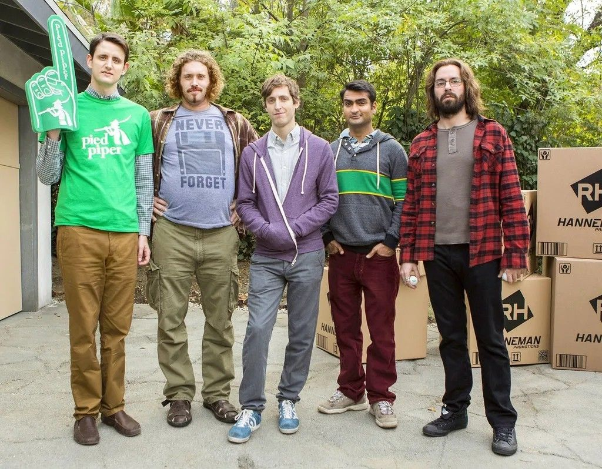

# 🌍 TRAVELAI  
### *Интеллектуальная платформа персонализированного туризма*

> **Давайте вместе сделаем туризм лучше — умнее, безопаснее и экологичнее.**

---

## 🚀 О проекте

**TravelAI** — это модульная цифровая платформа, объединяющая сервисы **FishAgent** и **CampAgent**, чтобы предоставлять пользователям **мгновенные, персонализированные рекомендации** для рыбалки и кемпинга — с учётом:

- 🎯 Ваших личных предпочтений  
- 📊 Текущей загруженности локаций  
- 🌿 Экосистемных и правовых ограничений  

---

## ✨ Возможности

✅ **Автоматическое построение маршрутов**  
✅ **Прогнозирование потока туристов**  
✅ **Альтернативные варианты при перегрузке локаций**  
✅ **Сохранение истории поездок**  
✅ **Экстренная передача данных спасателям и родственникам**  
✅ **Автопредупреждения на основе экологических и юридических норм**

---

## 🌱 Ценности

Мы создаём туризм будущего:

- 🧭 **Безопасный** — автоматические уведомления и помощь в ЧС  
- 🌲 **Экологичный** — учёт нагрузки на природу и ограничений  
- 💡 **Умный** — ИИ подстраивается под вас и ситуацию в реальном времени  
- ❤️ **Человечный** — забота о комфорте и воспоминаниях

---

> 📣 **Присоединяйтесь к движению за осознанный и технологичный туризм!**  
> *TravelAI — не просто сервис. Это новый стандарт путешествий.*
